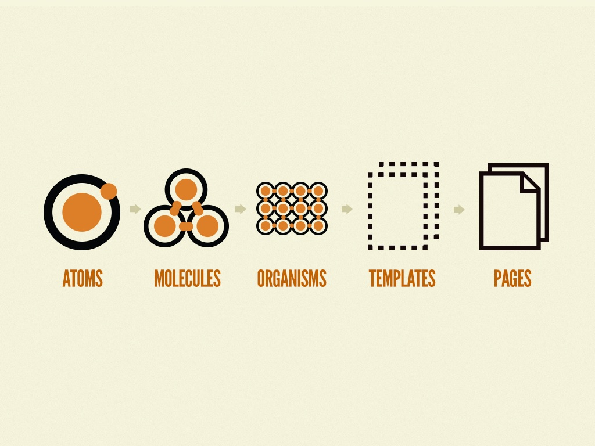

footer: **UIKit: style in Swift way** - Eduard Panasiuk - https://github.com/somedev

#UIKit: style in Swift way
### Eduard Panasiuk

---

#The problem

---

#The problem

---

#The problem
### - Setup similar UIKit elements (such as UILabel, UIButton, UITextView ...)
### - Code duplicating

^ Привести примеры, рассказать про Atomic  Design

---

#Playground

---
#Atomic Design

<!--  -->

---

^subscription screens

---