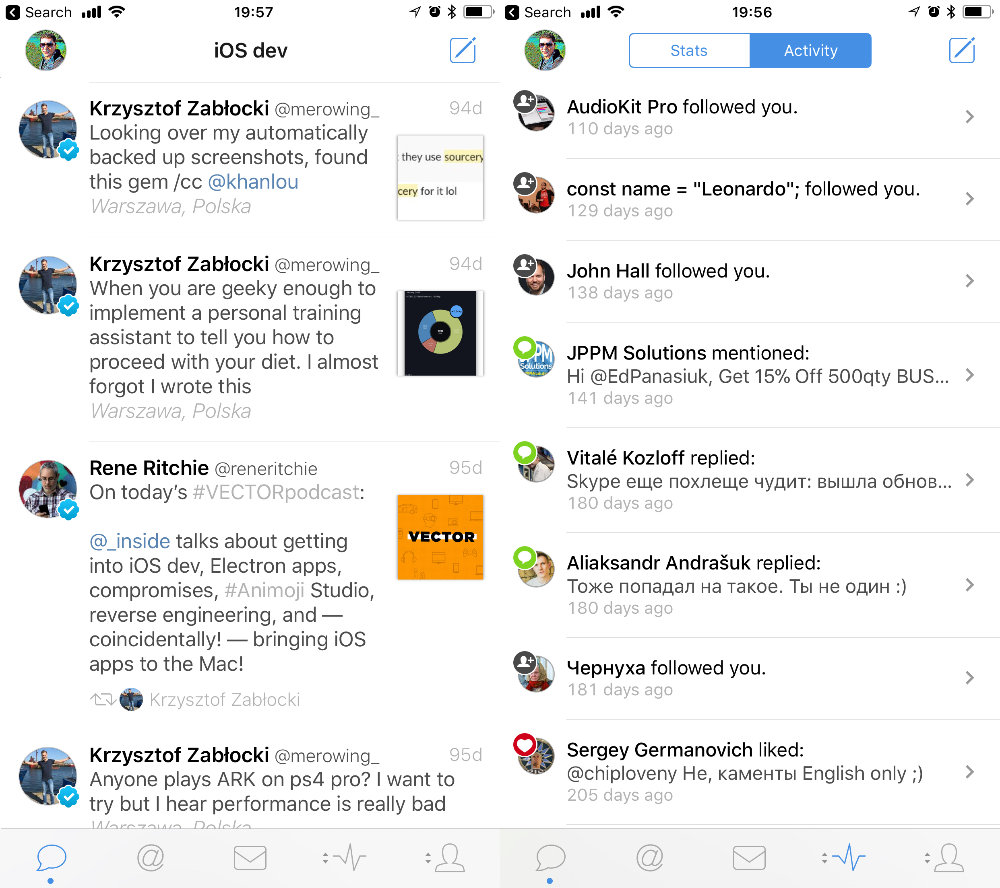
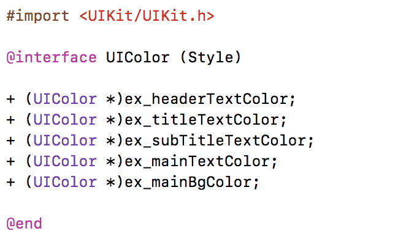
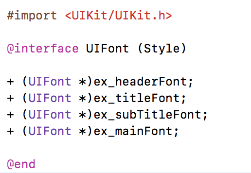
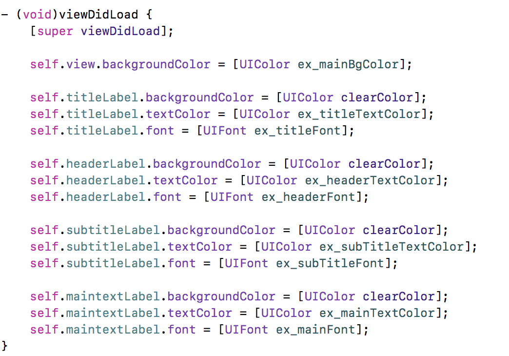
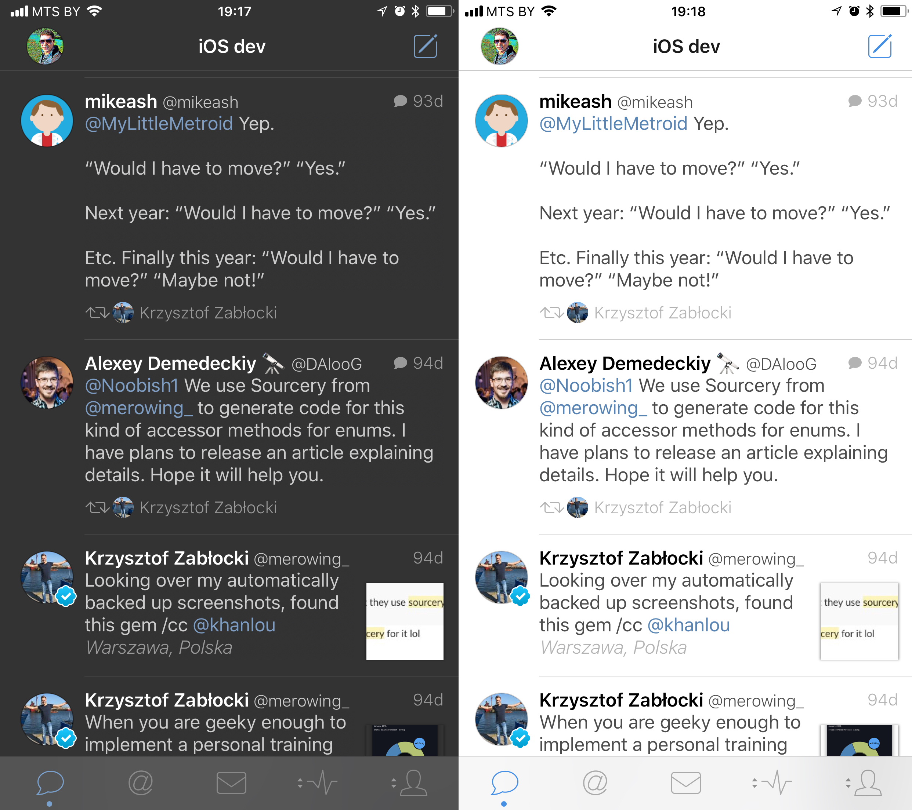
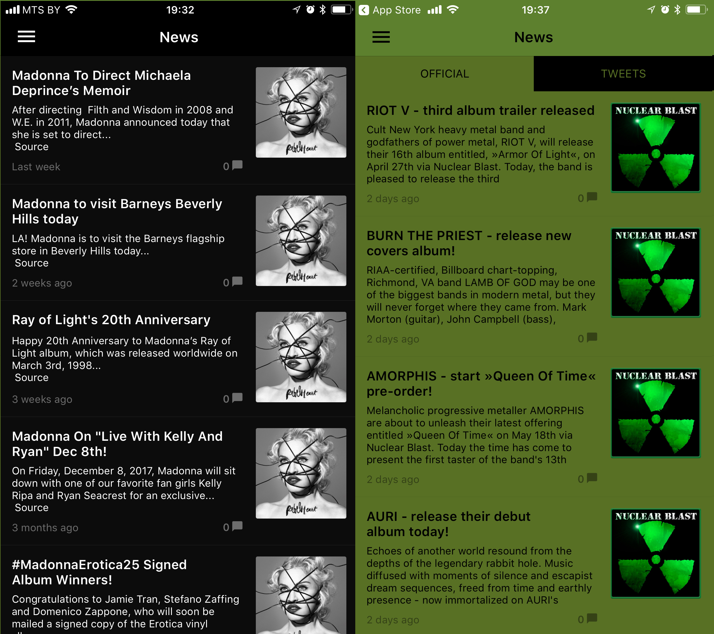
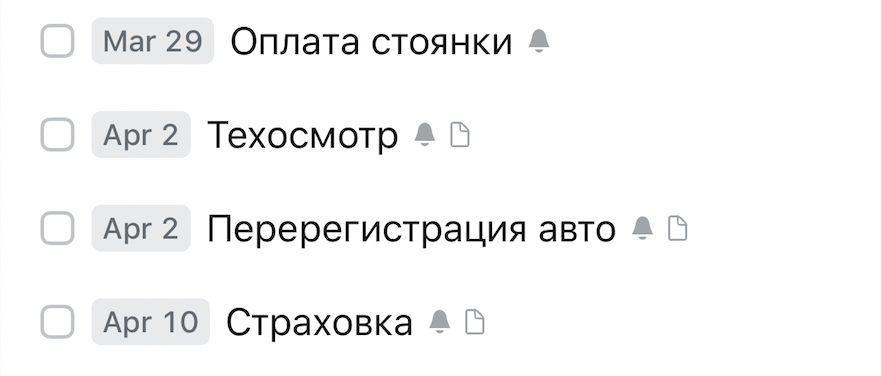
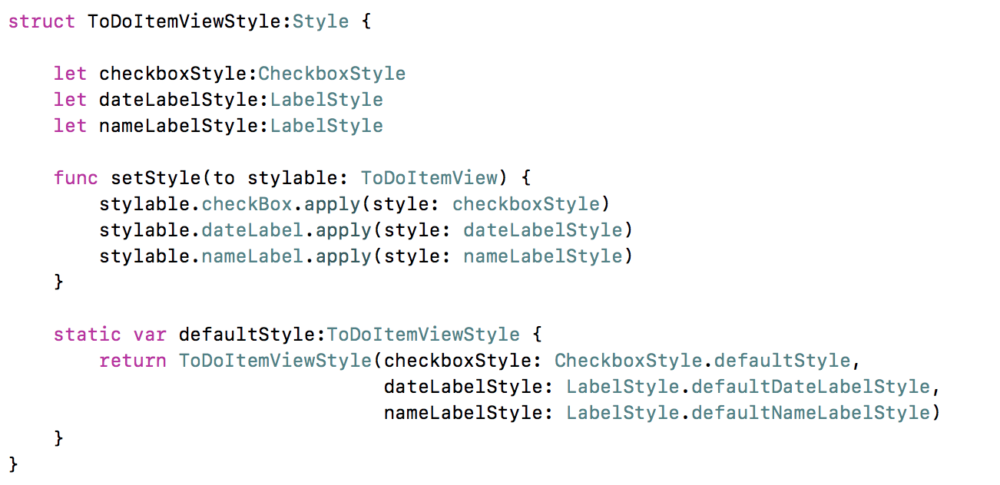
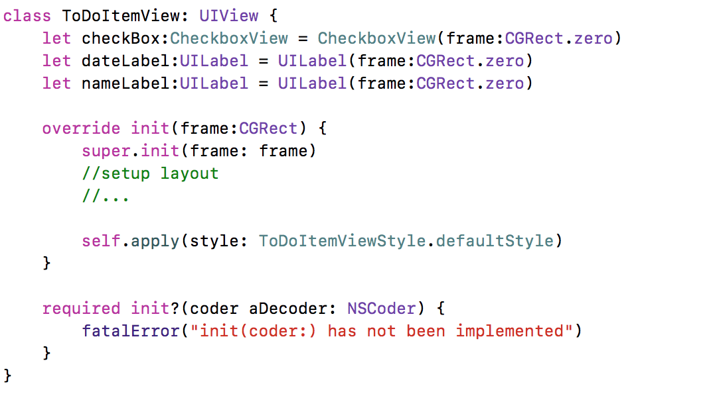

footer: **UIKit: style in Swift way** - Eduard Panasiuk - https://github.com/somedev

#UIKit: style in Swift way
### Eduard Panasiuk

---

#The problem

Using same color palette, fonts, sizes across application

^ При изменении требований кол-во изменений должно быть минимальным

---

#The problem

Moving UI elements parameters to categories

^ категории для цвета

---

#The problem

Moving UI elements parameters to categories

^ категории для шрифта

---

#The problem

Moving UI elements parameters to categories

^ конфигурирование элементов

---

#The problem

How about night theme?

^ приходит продакт и "А давайте ночной режим замутим"

---

#The problem

Moving UI elements parameters to categories

^ уже не подходит
^ Code duplicating
^ много дополнительных параметров (text align, opacity, corner radius ...)
 
---

#The problem

Multiple apps with same codebse & different UI styles?

^ приходит продакт и "А давайте ночной режим замутим"

---

#Solution
 
# "STYLE" for each UI element (UILabel, UIButton, UITextField, UIView ...)

^ понятие стиля

---

#Playground

---
#Atomic Design

---
#Atomic Design

View style contains styles for subviews

^ пример - ToDo app (Things) checkbox + label + label
^ пример - банер в нескольких местах аплика (label + button)

---

#Atomic Design

View style contains styles for subviews

---

#Atomic Design

View style contains styles for subviews

---

#Questions?